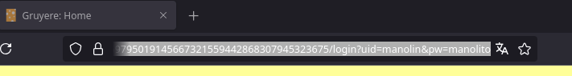
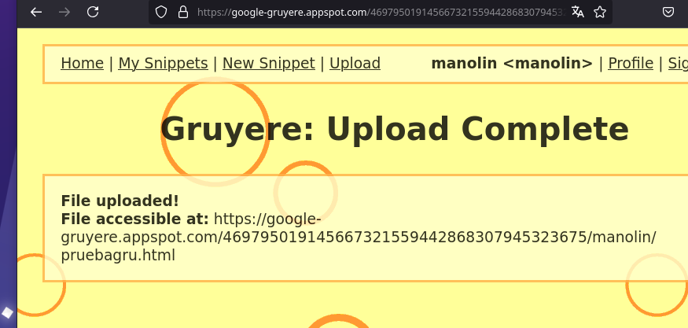
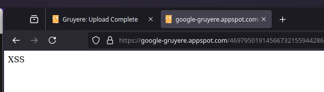
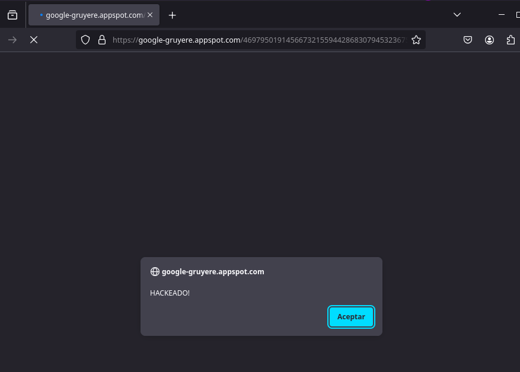
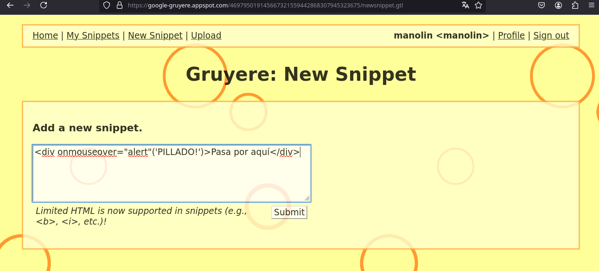
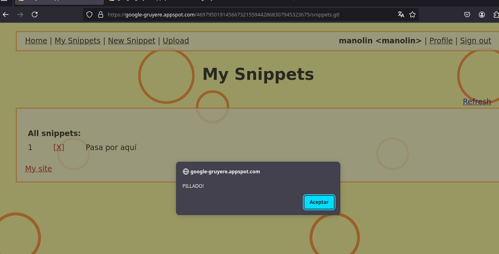
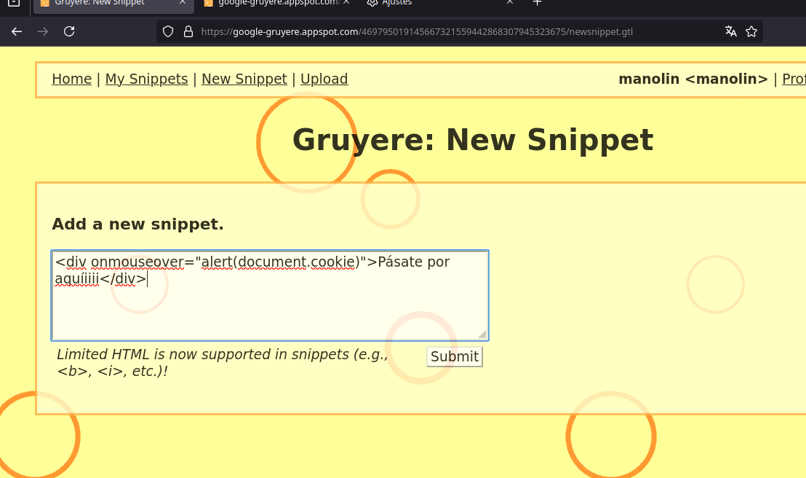
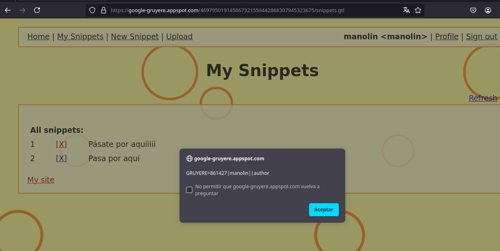
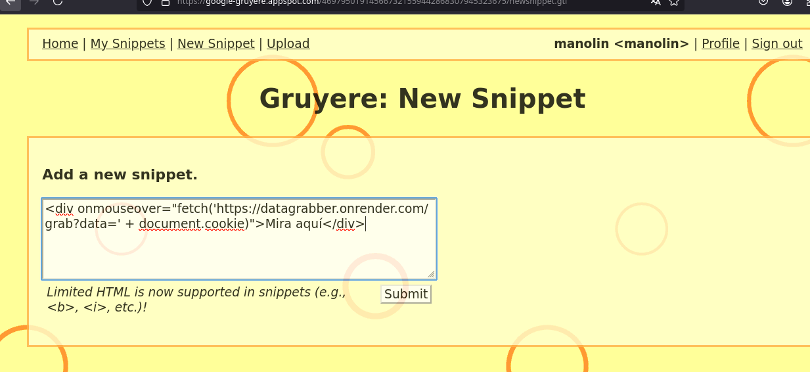

# Google Gruyere

1. Vamos a registrarnos en Google Gruyere.

   Lo primero que vemos es que se muestran en claro nuestro usuario y contraseña, lo cual representa una gran vulnerabilidad.

   

   Ahora vamos a subir un archivo a la página. Si fuese una página normal, no permitiría la ejecución del código de nuestro script y solo lo almacenaría, pero en este caso, sí permite ejecutarlo.

   Copiamos la dirección donde se ha almacenado nuestro archivo.

    

   Como podemos ver, se está ejecutando el código en la página.

    
    

   Ahora vamos a inyectar en el snippet un script que se ejecute al pasar el ratón por encima del texto y muestre una ventana emergente.

   

   Aquí podemos ver cómo aparece la pestaña emergente.

   

   Extraemos la cookie.

   
   

   Ahora lo que vamos a hacer es que, al pasar el ratón por encima del texto, se envíe mi cookie de usuario al backend (a mi servidor).

   

   Comprobamos cómo ha llegado la cookie.

   Ahora he iniciado sesión con otro usuario llamado Pepe.

   Desde la cuenta de Pepe, abro la terminal, voy a almacenamiento y modifico la cookie.

   Ahora modificaré la cookie de Pepe y colocaré la cookie de "hola", que es la que he enviado al servidor.

   Y al presionar Enter, ya me indica que soy "hola".
